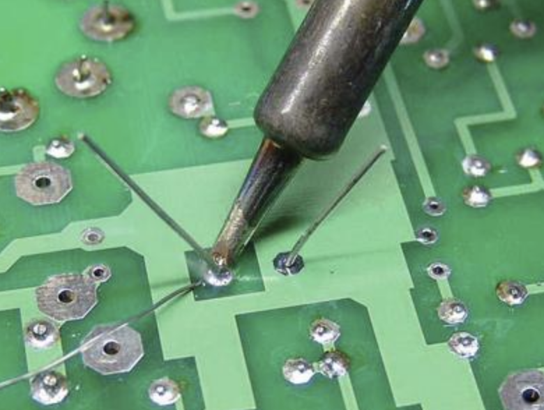

# How to solder

Building the kits requires a basic level of soldering skill. None of the components are SMD.

## Tips for soldering

## Things to look out for

* Cold joints
* Bridges

## Fixing soldering mistakes

* Solder-braid
* Fixing joints