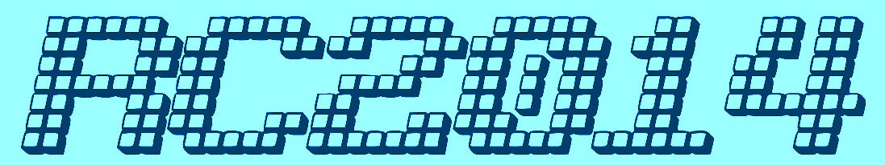

# Welcome

The RC2014 is a series of kits and products based around the idea of building simple computers - the kind of computers than were state of the art in the early 1980s.

This site is a list od products available from RC2014.co.uk, including assembly instructions, their operation, and a lot more.

## Contents

* [Introduction](introduction.html)
* [Kits](kits/kits.html)
  * [RC2014 Mini](kits/rc2014mini/guide.html)
* [Appendices](appendices.html)
  * [How to solder](appendices/soldering.html)
  * [Resistor color codes](appendices/resistor_color_code.html)
  * [IC numbering](appendices/ic_numbering.html)
  * [Other components](appendices/components.html)
* [Resources](resources.html)

---

