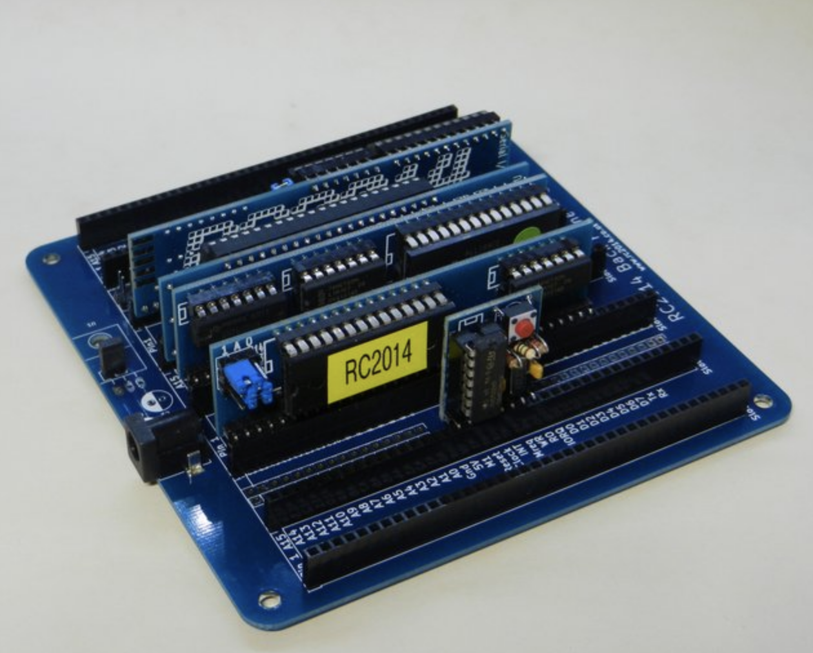

# Welcome

The RC2014 is a series of standards, kits and products based around the concept of building simple 8-bit computers - the kind of computers that were state-of-the-art in the early 1980s.

Building an RC2014 is an education in itself, but once complete it can also run software: from old-school BASIC to the CP/M operating system and literally thousands of applications.

Depending on how you spec out your kit, an RC2014 can connect to your existing computer to act as keyboard and display, or you can hook it up directly to a monitor and use the optional keyboard kit. "Flexible" doesn't come close to describing the options!

This site contains a full list of products available from [RC2014.co.uk](rc2014.co.uk), including assembly instructions, operation guides, and a lot more. You'll find suggested kits to get you going, lots of help if you are a newbie, and advanced technical information for the old hands.

## Contents

* [Introduction](introduction.html)

* [Kits & Modules](kits/kits.html)
  * [RC2014 Classic](kits/RC2014Classic/guide.html)
  * RC2014 Pro
  * RC2014 CP/M Edition
  * [RC2014 Mini](kits/rc2014mini/guide.html)
  * [Full list of available modules](kits/kits.html) and instructions.
* [Appendices](appendices/appendices.html)
  * [How to solder](appendices/soldering.html)
  * [Resistor color codes](appendices/resistor_color_codes.html)
  * [IC numbering](appendices/ic_numbering.html)
  * [Other components](appendices/components.html)
* [Resources](resources.html)
  * [Peripheral addressing](peripheral.html)
  * [Communications](communications.html)
  * Using ROMs on your RC2014
  * Creating your own ROMs
  * Introduction to BASIC
  * Introduction to CP/M
  * Introduction to the Small Computer Monitor
  * Designing your own RC2014 compatible hardware
  * List of RC2014 projects 

---

