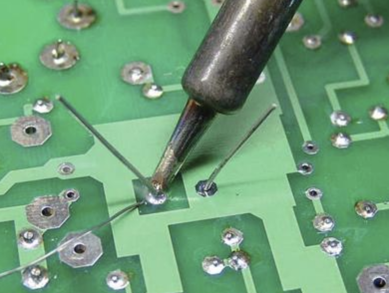
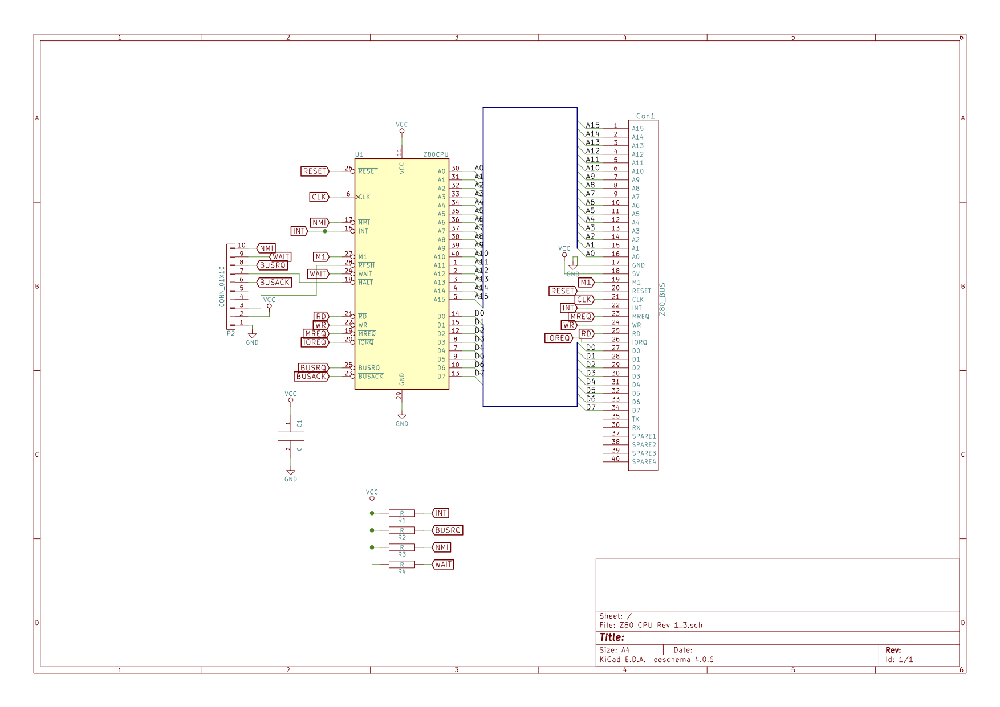

# Z80 2.1 CPU

## Description

This module is the "brain" of your RC2014 Classic or Pro.

Similar to the standard Z80 CPU Module, the v2.1 version is essentially a breakout board for the Z80 CPU with all of the signals needed for regular RC2014 use presented on pins on the standard header.

## How it works

Some signals, such as INT, BUSRQ, WAIT and NMI need to be pulled high for normal operation.  The original CPU Module did this with links to the 5v line – however, this meant that modules that needed to use these, such as the SD Memory Dump Module, risked damage to the CPU or module.  The v2.1 CPU Module overcomes this by using 10k resistors to pull the signals high, which allows them to be safely pulled low if required.

Instead of presenting these additional lines on a header at the top of the module, they are moved down to the Enhanced Bus, which means that this can be used with the Backplane Pro without having to run additional jumper wires.  It will, however, function perectly well with the original Backplane 8

The CPU socket pads are slightly oversized too, so that a ZIF socket can be used if required.

## Assembly instructions



### List of parts



<ul>
<li>Z80 CPU 2.1 PCB</li>
<li>40 pin DIL socket</li>
<li>Zilog Z80 CPU</li>
<li>40 pin RA Header</li>
<li>100nf capacitor</li>
<li>10K resitor x 4</li>
</ul>

### Solder the components

For general soldering tips, please read [Appendix - How to Solder](appendices/soldering.html).

**Step by step guide**

Solder all components to the PCB such that the components sit on the printed side, by their printed description.

1. IC socket.

Start by soldering the IC socket in place. Match the notch on the socket to the drawing on the PCB. Hold the socket in place using tape while you flip the board over, and solder. Start with one pin and make sure that the socket is tight fitting to the board and not sitting up on any corner. If it is, touch the iron to the soldered joint just enough to melt it and push the socket tight to the board.

2. Right-angled header

The header should be placed as shown below:

Hold the header in place with tape, and then solder just one pin to make sure it's attached evenly to the circuit board. Then continue from the other end.

3. Resistors

Solder the four resistors in place. Resistors do not need to be placed in a specific orientation. Bend the legs to the right width, and then place them in the circuit board, placing a piece of tape to hold them in place. Solder each leg, and when complete, snip off the excess wire (anything over 2mm or 1/16 of an inch) from the bottom of the board.

4. Capacitor

There is a single capacitor, and it can fit in either orientation. Hold it in place with tape, and solder carefully.

5. Insert the CPU into the socket. 

The notch will be to the left as you look at the circuit board.

## 

Inspect the board carefully for any solder bridges, or dull-looking joints which may be "cold" and therefore not conduct properly. Repair if necessary.

## Troubleshooting

If when placed in the backplane, this board does not seem to work:

* Confirm the IC is in the correct orientation.

* Check that no pins of the IC have bent instead of going into the socket. Sometimes and IC will need to be pressed firmly against a desk to straighten up the legs enough to fit into a socket.

* Using a multimeter, check the path from each pin on the IC to the pins on the header.

## Circuit diagram

## Compatibility

This module is compatible with:

* All the modules