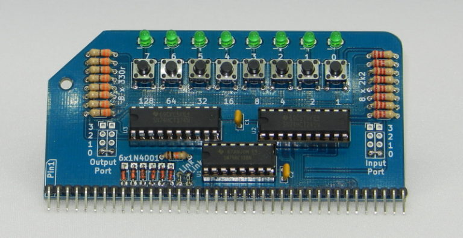
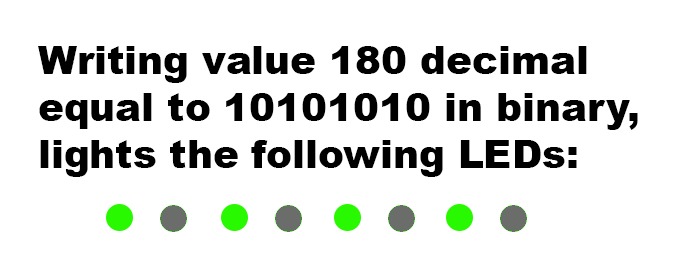
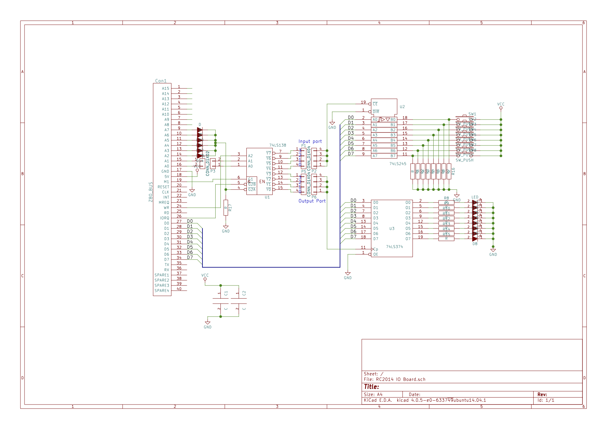

# Digital I/O



## Description

The digital I/O module provides 8 lines of digital input and 8 lines of digital output via push buttons and LEDs. Values between 0 and 255 can be read from or written to port 0, 1, 2, or 3. if a number is set to the port, then it's binary equivalent is displayed on the LEDs. For example:



When reading the port, the current state reflects which buttons are pressed. For example, if only the left-most button was pressed, the value returned would be 128 (which is 10000000 in binary).

## How it works

All address lines A0 – A7 along with M1, IOReq and !WR are used to select the multiplexer 74LS138. A2 to A7 are connected via diodes to the enable pin !G2A, such that any of these address lines going high will disable the chip. A0 and A1 are used for selecting the output of the 74LS138, thus the address of this module is 0b00000000, 0b00000001, 0b00000010 or 0b00000011 (0, 1, 2 or 3)

The 74LS138 is capable of 8 lines of switching, although for this board, only 2 (1 input and 1 output) are used. Typically port 0 will be used, but this is selectable from 0 – 3 by soldering links where indicated on the PCB. A0, A1 and !WR are used to select which one of the 8 outputs is enabled.

For further information on port addressing, see [Peripheral addressing](peripheral.html).

A 74LS245 transceiver is used to read (!Dir connected to ground) 8 spst tactile switches. These switches are pulled low by 2k2 resistors and when the Chip Enable pin is pulled high, the value of these 8 switches are put on the data bus.

Similarly, a 74LS374 flip-flop will read the data bus when the Chip Enable pin is pulled high, and output the values on 8 LEDs via 330 ohm resistors. This value is latched, so when the CE pin is no longer high, the output stays to what it was last set to.


## Assembly instructions



### Check list of parts



<ul>
<li>RC2014 Digital I/O PCB</li>
<li>40 pin header</li>
<li>20 pin narrow DIL socket x 2</li>
<li>16 pin narrow DIL socket</li>
<li>74HCT245</li>
<li>74HCT374</li>
<li>74HCT138</li>
<li>3mm Green LED x 8</li>
<li>Tactile Switch x 8</li>
<li>2k2 resistor x8</li>
<li>330R resistor x 8</li>
<li>10k resistor x 1</li>
<li>1N4148 diode x 6</li>
<li>100nf capacitor x 2</li>
</ul>


(Photo of the parts laid out)

 Please take care to identify each correctly - some look very similar. Resistors are identified with the [Resistor Color Codes](appendices/resistor_color_codes.htm). IC's are numbered from the notch. [appendices/ic_numbers.html]. Diodes and LEDs must be connected the right way around.


### Solder the components

For general soldering tips, please read [Appendix - How to Solder](appendices/soldering.html).

**Step by step guide**


Solder all components to the PCB such that the components sit on the printed side, by their printed description.

1. IC sockets.

Start by soldering the IC sockets in place. Match the notch on the sockets to the drawing on the PCB.

2. Resistors

3. Jumper pins


### Completing and testing

In BASIC the port can be read with the INP(0) command which will return a number from 0 to 255, and written to with OUT 0,x where x is the number to output from 0 to 255

In assembly language, the mnemonics in a , (0) and out (0) , a do the same function

Here is an example BASIC program that tests if the buttons are being pressed, and lights their counterpart LED if they are.

```BASIC
10 OUT 0,INP(0)
20 GOTO 10
```

Here is a simple cylon scanner program

```BASIC
10 FOR F=0 TO 7
20 OUT 0,2^F
30 GOSUB 100
40 NEXT F
50 FOR F=7 TO 0 STEP -1
60 OUT 0,2^F
70 GOSUB 100
80 NEXT F
90 GOTO 10
100 FOR X = 1 TO 150 : NEXT X : RETURN
```


## Troubleshooting

If your kit doesn't work, please check the following:


## Circuit diagram



## Compatibility

This module works with:

* RC2014 Classic
* RC2014 Pro
* RC2014 Mini


## Availability

Buy one [here](https://www.tindie.com/products/Semachthemonkey/digital-io-module-for-rc2014-z80-homebrew-computer/).
