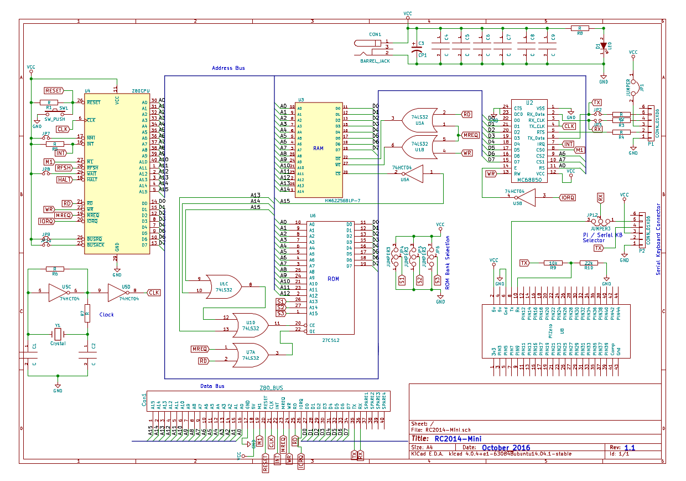

# RC2014 Mini

## Description

The RC2014 Mini is a single board computer which combines the CPU, ROM, RAM, Clock, Serial I/O and Pi Terminal of the classic modular RC2014 on to a single PCB.

Having all the functions on a single board reduces the component count and therefore the amount of soldering compared to the modular equivalent.  It also allows more efficient use of the logic chips.  This efficiency comes at the expense of upgradability, where the modular option allows for any of the functions to be replaced if required.  The likelihood of wanting to swap major components should be weighed up to determine if the modular or the Mini approach is right for you.

Photo of kit.

## Assembly

### Before you begin..

Tool list and other requiremets

### Warnings

* Soldering warning
* Handling components
* Polarity

### Check list of parts

1 x RC2014 Mini PCB
1 x 24 pin wide DIL socket
2 x 28 pin wide DIL socket
1 x 40 pin wide DIL socket
3 x 14 pin narrow DIL socket
1 x Z80 CPU
1 x 27C512 EPROM BASIC
1 x 62256 RAM
1 x MC68B50
1 x 74HCT04
2 x 74LS32
1 x 7.3728 Mhz Xtal
2 x 22pf ceramic cap
6 x 100nf cap
4 x 1k resistor
1 x 1M resitor
1 x 10k resistor
1 x 22k resistor
1 x 2k2 resistor
1 x 330r resistor
1 x 3k3 resistor
1 x 3mm green led
1 x RA Tactile Switch
1 x 2 pin header
4 x 3 pin header
2 x 20 pin header
1 x 40 pin header
1 x 40 pin RA header
1 x 6 pin ra header
1 x 2 x 20 pin socket
1 x 40 Way SIL Socket
1 x 6 way SIL socket
5 x jumper
1 x 2.1mm power jack
1 x USB Barrel Lead

Photo of parts

### Solder the components

Step by step guide

1. IC sockets.
2. Resistors
3. Jumper pins

### Completing and testing

1. Insert the chips into the sockets

## Troubleshooting

## Circuit diagram

## Related projects

