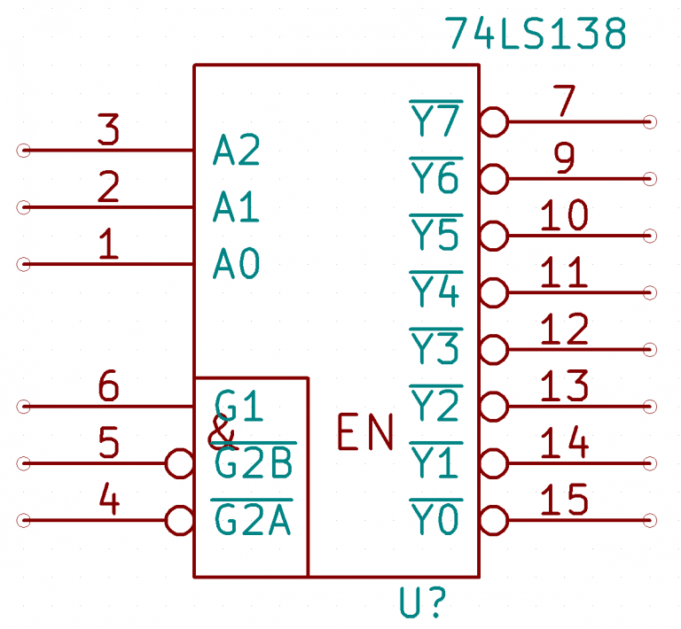
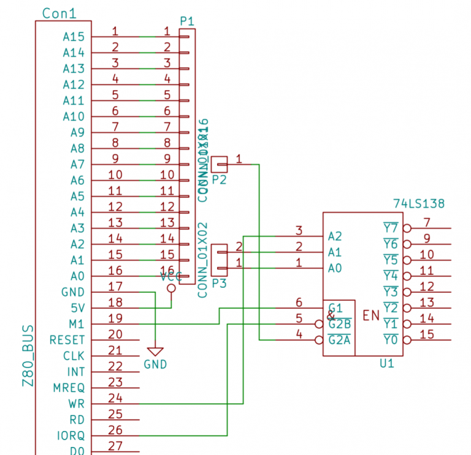
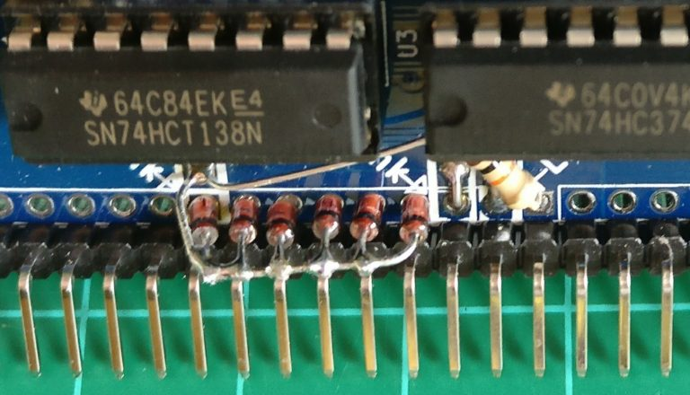

# Peripheral Addressing

The RC2014 currently uses a very simple, although inefficient method of addressing peripherals.  Most of the expansion modules feature a 74HCT138 used to provide up to 8 enable lines from 3 address signals.  For the purposes of this document, I will mainly refer to the Digital I/O Module, but the principals apply to all modules with a 74HCT138 (generally referred to simply as ‘138)

It is worth noting that the Z80 CPU can address up to 255 Input or 155 output addresses.  These are selected by the first 8 address lines (A0 – A7), IORQ going low and either WR or RD going low.

The ’138 has 3 enable pins, G1, G2B, G2A, all of which need to be true (G1 needs to be high, and both G2B and G2A need to be low) for the ‘138 to be enabled.  When it is enabled, the 3 address lines, A0, A1, A2 are read.  These 3 addresses have 8 possible combinations (000, 001, 010, 011, 100, 101, 110, 111), which will activate one of the 8 outputs Y0 to Y7.

In the Digital I/O Module, the ‘138 is activated when M1 is high, IORQ is low and A7 is low.  This corresponds to any port from 0 to 127 (IORQ being low indicates the address bus represents port, and A7 being low indicates the address bus is lower than 127).  [Side note – Serial I/O Module uses addresses 128 and 129, which are indicated by A7 being high].

The Z80 address pins A0 and A1, along with WR are connected to the address pins A0, A1, A2 on the ‘138.  This gives 4 addresses (00, 01, 10, 11) with the write bit high, and 4 with it low.

In normal use, the ports are addressed as 0 (In 0 or Out 0) on the Digital I/O Module.  (Or port 0, 1, 2 on the Digital Input module, for example).  However, any address that has A0, A1 and A7 low will work; 0—–00.  So echoes of this will appear on 4, 8, 12… 124.  So, whilst this works, and is fine for a small system without much I/O requirements, it quickly becomes inefficient as you need more ports.  In particular, it will clash with the Compact Flash Storage Module, which can have an impact on running CP/M.

In an ideal world, every peripheral should have a unique address, and with a lot of digital logic, this is certainly possible to do.  However, it will add both complexity and cost as well as needing more board space.

The easy solution, however, involves just 6 diodes and a resistor.  By connecting address lines A2 – A7 to the anode of each diode and the cathode of each diode to the G2A enable pin on the ‘138, any address above 00000011 will prevent the ‘138 from being enabled.  Effectively all the diodes are acting as a very simple OR gate.  A 10k resistor will bias the output low.

So with this set up, it will give just 4 unique addresses; 00000000, 00000001, 00000010, 00000011 (ie 0, 1, 2, 3) which for the Digital I/O Module, or the Digital Input or Digital Output is ideal.

Other addresses can be selected by changing which address pin the diodes are connected to.  So, for example, if A1 was connected to a diode instead of A3, and A3 went to the ‘138, the addresses would be 00000000, 00000001, 00001000, 00001001 (ie 0, 1, 8, 9).  Whilst it cuts down on the echoes at higher addresses, it’s still not perfect – but much better and still very cheap with minimal extra board space needed.

The Digital I/O Module has now been updated to reflect this change.  As PCB stocks run low on other modules, they too will have similar updates.  If you already have a non-diode selectable module, and wish to implement this, it is actually very simple to do as shown below.

